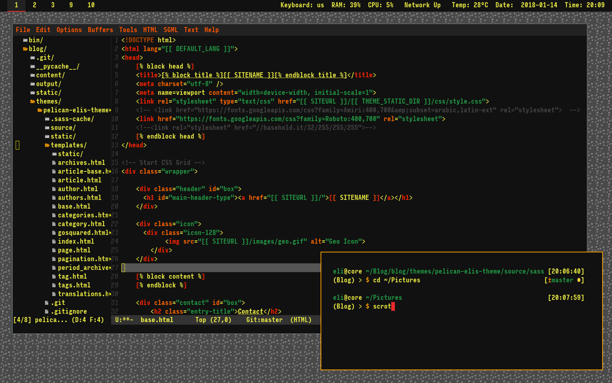

# Emacs Campfire Theme
🔥 A dark theme for Emacs in warm colors.




## About

Campfire for Emacs is a dark theme in warm colors with minimal blue light. Designed for use at night in low light. 

## Installation

Download `campfire-theme.el` to the directory `~/.emacs.d/themes/`. Add this to your
`.emacs`:

```lisp
(add-to-list 'custom-theme-load-path "~/.emacs.d/themes/")
```

Now you can load the theme with the interactive function `load-theme` like this:
```
M-x load-theme RET campfire
```
